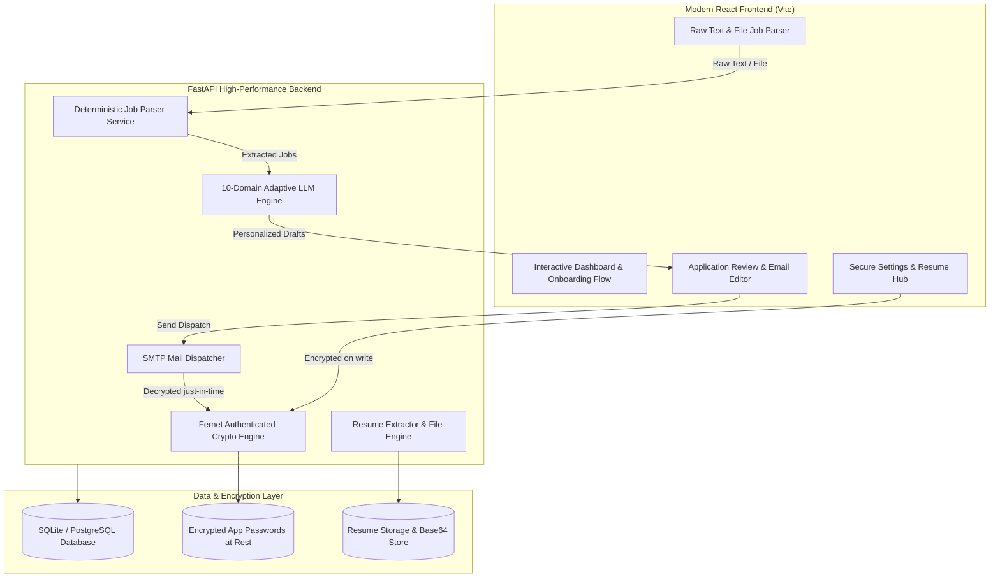

# AI Job Application Assistant 🚀

An intelligent, full-stack automation platform designed to parse multi-format job postings (from WhatsApp broadcasts, LinkedIn listings, and job alerts), dynamically generate hyper-personalized application emails across 10 specialized career domains, and dispatch direct SMTP emails with tailored resumes and enterprise-grade security.

---

## 🌟 Key Highlights & Core Capabilities

- **⚡ High-Throughput Multi-Job Batch Parser**
  - Ingests raw unstructured text containing single or 10+ job postings in one paste.
  - Intelligently extracts Company Name, Role, Location, Batch/Experience, Recipient Email, Explicit Subject Instructions, and Required Tech Stack.
  - Cleans emoji noise, formats variations, and sanitizes trailing punctuation from email addresses.

- **🧠 Multi-Domain Deterministic AI LLM Engine**
  - **100% Unique Email Generation**: Every application email is crafted individually with company-specific details, candidate background alignment, and domain context.
  - **10 Domain Classifications**:
    1. `AI_FRONTEND` — AI Full-Stack & Web-AI Integration
    2. `AI_ML` — Machine Learning, NLP, Computer Vision & Data Science
    3. `FRONTEND_MOBILE` — React.js, Mobile & Modern UI/UX Engineering
    4. `BACKEND_API` — RESTful Architecture, Server Engineering & Databases
    5. `DEVOPS_CLOUD` — Docker, CI/CD, Linux & Cloud Infrastructure
    6. `QA_TESTING` — STLC, Automation & Manual Quality Assurance
    7. `HR_RECRUITMENT` — Talent Acquisition, People Ops & Sourcing
    8. `BUSINESS_MARKETING` — Business Development, Growth & Client Relations
    9. `DATA_ANALYTICS` — Data Insights, SQL, Reporting & Business Intelligence
    10. `GENERAL` — General Software Development & Core Engineering

- **🎯 Smart Subject Line Customization**
  - Recognizes explicit recruiter subject line instructions (e.g., `SIP - Position - Name`, `Application for BDE Intern (Your Name)`, `[Position] - [Name]`, `<Role> - <Name>`).
  - Automatically injects candidate name and target role into templates while preserving company formatting mandates.

- **🔒 Enterprise-Grade App Password Security**
  - **Encryption at Rest**: Sensitive Gmail App Passwords and credentials are encrypted using **Fernet AES-128-CBC + HMAC-SHA256** authenticated cryptography.
  - **PBKDF2 Key Derivation**: 32-byte master encryption key derived via SHA-256 with 100,000 iterations and dedicated cryptographic salt.
  - **Zero-Exposure API Masking**: Passwords are automatically masked (`••••••••••••••••`) in all API responses and browser state.
  - **Encrypted Stateless Tokens**: JWT session payloads store encrypted tokens, preventing developer-tool inspection.
  - **Just-In-Time In-Memory Decryption**: Plaintext credentials only exist in memory during active SMTP socket connections.

- **📄 Automatic Resume Extraction & Serverless Attachment**
  - Automated PDF/DOCX resume parsing extracting Name, Contact, Degree, College, Graduation Year, Skills, Projects, and Social Links.
  - Base64 database replication for reliable resume attachment across serverless cloud environments.

- **🛡️ Delivery Safeguards & Verification**
  - Automatic email format validation, missing field detection, duplicate application prevention, and batch send concurrency via ThreadPoolExecutor.

---

## 🏗️ System Architecture

---

## 🛠️ Technology Stack

### **Frontend**
- **Framework**: React 19
- **Build Tool**: Vite 8
- **Styling**: Vanilla CSS (Tailored Design System, Glassmorphism, Dark Mode)
- **Icons**: Lucide React
- **State & Networking**: Native Fetch API with Bearer Token Authorization

### **Backend**
- **Framework**: FastAPI (Python 3.10+)
- **Server**: Uvicorn & Mangum (Serverless Handler)
- **ORM & Database**: SQLAlchemy 2.0 with SQLite / PostgreSQL support
- **Cryptography & Security**: `cryptography` (Fernet authenticated encryption, PBKDF2 HMAC-SHA256), `hashlib`, `hmac`
- **Document Processing**: `pypdf`, `python-docx`
- **Concurrency**: `concurrent.futures.ThreadPoolExecutor` for parallel batch parsing and email generation

---

## 🔄 End-to-End Application Workflow

1. **Candidate Onboarding & Resume Parsing**:
   - The candidate uploads their resume or fills in their profile details (Education, Skills, Projects, Socials, Gmail App Password).
   - App passwords are instantaneously encrypted at rest.
2. **Job Post Ingestion**:
   - The candidate pastes job broadcast messages or uploads job files.
   - The system parses individual job postings concurrently and classifies their domains.
3. **Automated AI Email Generation**:
   - Tailored subject lines and body paragraphs are dynamically composed based on the candidate's skills and the specific job requirements.
4. **Review & Batch Send**:
   - The candidate reviews the parsed entries and generated emails.
   - Upon clicking Send (or Batch Send), the system securely attaches the active resume and delivers the application directly via Gmail SMTP.

---

## 📊 Automated Verification & Test Coverage

The system includes test suites covering:
- **10/10 Domain Classifications** and dynamic email personalization.
- **Fernet AES Cryptographic Encryption**, decryption, and API response masking.
- **Stateless JWT Token Tamper Resistance**.
- **Multi-Job WhatsApp Broadcast Parsing** with noise filtering.
- **Explicit Subject Line Placeholder Injection** across diverse format templates.
- **Email Validation Safeguards** and duplicate application prevention.
