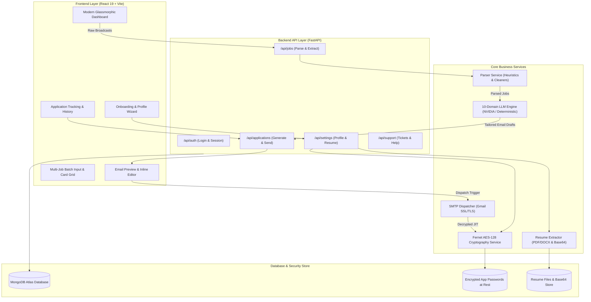

# 🚀 AI Job Application Assistant

<div align="center">

[](https://fastapi.tiangolo.com)
[](https://react.dev)
[](https://vitejs.dev)
[](https://www.python.org)
[](https://www.mongodb.com)
[](https://cryptography.io)
[](LICENSE)

<p align="center">
  <b>Transform noisy WhatsApp, LinkedIn, and Telegram job broadcasts into hyper-personalized, tailored job applications sent directly with your resume in seconds.</b>
</p>

[Key Features](#-key-features) • [System Architecture](#-system-architecture) • [Tech Stack](#-technology-stack) • [Quickstart Guide](#-quickstart-guide) • [Gmail App Password](#-gmail-app-password-setup) • [API Reference](#-api-endpoints) • [Deployment](#-deployment)

</div>

---

## 📖 Overview

Job hunting across WhatsApp groups, Telegram channels, and LinkedIn alerts often requires manually copying job details, composing unique emails, tailoring subject lines, attaching resumes, and dispatching them one by one.

**AI Job Application Assistant** solves this through end-to-end automation:
1. **Pasting multi-job unstructured broadcasts** into an intelligent regex + heuristic parser.
2. **Classifying roles into 10 domain archetypes** (AI, Frontend, Backend, DevOps, Data, HR, Marketing, etc.).
3. **Generating 100% unique, recruiter-ready cold emails** matched to the candidate's exact background and project highlights.
4. **Auto-formatting subject lines** according to mandatory recruiter templates (e.g. `[Job ID] - [Role] - [Candidate Name]`).
5. **Securely attaching active resumes & dispatching** via encrypted Gmail SMTP sockets.

---

## 🌟 Key Features

### ⚡ High-Throughput Batch Job Parser
- **Multi-Job Ingestion**: Ingests single or 10+ jobs from a single text block.
- **Smart Extraction**: Extracts Company Name, Target Role, Location, Batch/Experience, Recipient Email, Tech Stack, and Recruiter-Mandated Subject instructions.
- **Sanitization Engine**: Cleans emoji clutter, WhatsApp forwarding headers, formatting artifacts, and trailing punctuation.

### 🧠 10-Domain AI LLM Personalization Engine
- **Deterministic & Cloud LLM Ready**: Integrates with NVIDIA Nemotron / OpenAI APIs while providing an ultra-fast, highly accurate deterministic fallback.
- **Domain Specializations**:
  1. `AI_FRONTEND` — AI Full-Stack & Generative UI Integration
  2. `AI_ML` — Machine Learning, NLP, Deep Learning & Computer Vision
  3. `FRONTEND_MOBILE` — React, Next.js, React Native & Modern UI/UX
  4. `BACKEND_API` — Distributed Systems, REST/GraphQL & Database Engineering
  5. `DEVOPS_CLOUD` — Docker, Kubernetes, CI/CD pipelines & Cloud Architecture
  6. `QA_TESTING` — STLC, Automation Frameworks (Selenium/Cypress) & Manual QA
  7. `HR_RECRUITMENT` — Talent Acquisition, People Operations & Sourcing
  8. `BUSINESS_MARKETING` — Business Development, Growth Strategy & Sales
  9. `DATA_ANALYTICS` — SQL, Data Warehousing, PowerBI & Insights
  10. `GENERAL` — Full-Stack & Core Software Engineering

### 🎯 Recruiter Subject Template Intelligence
- Auto-detects custom subject line formulas required by recruiters (e.g., `SIP - Position - Name`, `Application for BDE Intern (Your Name)`, `[Role] - [Candidate Name] - [Batch]`).
- Dynamically injects candidate profile details while adhering strictly to company formatting rules.

### 🔒 Enterprise-Grade App Password Security
- **AES-128-CBC + HMAC-SHA256 Encryption**: App passwords encrypted at rest with Fernet cryptography.
- **PBKDF2 Key Derivation**: 32-byte master key derived with SHA-256 and 100,000 iterations.
- **Zero-Exposure Response Masking**: Passwords are permanently masked (`••••••••••••••••`) in all API responses and frontend state.
- **Just-In-Time (JIT) In-Memory Decryption**: Plaintext credentials only exist in memory during active SMTP socket connections.

### 📄 Smart Resume Parsing & Multi-Format Cloud Attachments
- Parses `.pdf` and `.docx` resumes, extracting Skills, Education, Degree, Projects, Experience, and Social links.
- Base64 storage replication ensures reliable resume delivery across serverless platforms without persistent disk dependencies.

### 📊 Modern UI & Application Management Hub
- **Interactive React 19 Dashboard**: Glassmorphic dark aesthetic, real-time statistics, responsive sidebar, and animated status cards.
- **Multi-Step Onboarding Flow**: Seamless candidate profile creation and live resume ingestion.
- **Live Email Preview & Editor**: In-place subject/body editing before dispatch.
- **Application History Tracker**: Filter and track application states (`DRAFT`, `SENT`, `FAILED`, `DUPLICATE`).
- **In-App Support Center**: Support ticket submission, FAQ directory, and troubleshooting hub.

---

## 🏗️ System Architecture



---

## 🛠️ Technology Stack

| Layer | Technologies |
|---|---|
| **Frontend** | React 19, Vite 8, Lucide Icons, Vanilla CSS Design System, Responsive Glassmorphism |
| **Backend** | Python 3.10+, FastAPI, Uvicorn, Mangum (Serverless Handler), Pydantic v2 |
| **Database & ORM** | MongoDB Atlas (via PyMongo & Motor), SQLAlchemy 2.0 (SQLite / PostgreSQL fallback) |
| **Security & Cryptography** | `cryptography` (Fernet AES-128-CBC + PBKDF2 HMAC-SHA256), `hashlib`, Masking Layer |
| **Document Processing** | `pypdf`, `python-docx` |
| **Email Protocol** | Python `smtplib`, `email.mime`, SSL/TLS (Port 587) |
| **AI / LLM Integration** | NVIDIA Nemotron API, OpenAI API Client, Multi-Domain Deterministic Engine |

---

## 📂 Project Structure

```
JOB SEND/
├── backend/
│   ├── database/
│   │   └── db.py                     # MongoDB & SQLite connection managers
│   ├── models/
│   │   ├── models.py                 # Core domain models
│   │   └── schemas.py                # Pydantic validation schemas
│   ├── routes/
│   │   ├── auth.py                   # Authentication & user profile endpoints
│   │   ├── jobs.py                   # Job broadcast parsing endpoints
│   │   ├── applications.py           # Email generation & batch SMTP dispatch
│   │   ├── settings.py               # User settings, profile, & resume upload
│   │   └── support.py                # Support ticketing & contact system
│   ├── services/
│   │   ├── crypto_service.py         # Fernet encryption & credential masking
│   │   ├── email_service.py          # SMTP email builder & dispatcher
│   │   ├── llm_engine.py             # 10-domain AI email generation engine
│   │   ├── parser_service.py         # Multi-job broadcast extraction & regex
│   │   ├── resume_extractor_service.py # PDF/DOCX resume text parser
│   │   └── resume_service.py         # File persistence & Base64 storage
│   └── main.py                       # FastAPI application entrypoint
├── frontend/
│   ├── src/
│   │   ├── components/
│   │   │   ├── ChatInput.jsx         # Broadcast text & file upload input
│   │   │   ├── EmailPreviewModal.jsx # Full-featured email review & editor
│   │   │   ├── Header.jsx            # Top navigation & session indicator
│   │   │   ├── JobCard.jsx           # Parsed job card with domain badge
│   │   │   ├── ProfileForm.jsx       # Profile, links, & skills configuration
│   │   │   ├── Sidebar.jsx           # App navigation sidebar
│   │   │   └── StatusBadge.jsx       # Visual status indicator component
│   │   ├── pages/
│   │   │   ├── ApplicationsPage.jsx  # History of sent and drafted emails
│   │   │   ├── Dashboard.jsx         # Main parsing & dispatch cockpit
│   │   │   ├── LoginPage.jsx         # User login & registration
│   │   │   ├── OnboardingFlow.jsx    # Guided setup & resume onboarding
│   │   │   ├── ProfilePage.jsx       # Profile details & skills editor
│   │   │   ├── SettingsPage.jsx      # SMTP & password security management
│   │   │   └── SupportPage.jsx       # In-app support tickets & FAQ
│   │   ├── App.jsx                   # Router & central application state
│   │   ├── App.css                   # Component layouts & animations
│   │   └── index.css                 # Global design system & theme variables
│   ├── package.json
│   └── vite.config.js
├── api/
│   └── index.py                      # Vercel serverless entrypoint
├── .env.example                      # Template environment variables
├── requirements.txt                  # Python dependencies
├── vercel.json                       # Vercel cloud deployment config
└── README.md                         # Comprehensive documentation
```

---

## 🚀 Quickstart Guide

### Prerequisites
- **Node.js**: v18.0.0 or higher
- **Python**: v3.10 or higher
- **Gmail Account** with 2-Step Verification enabled

---

### Step 1: Clone the Repository

```bash
git clone https://github.com/your-username/ai-job-assistant.git
cd ai-job-assistant
```

---

### Step 2: Configure Environment Variables

Create a `.env` file in the root directory:

```bash
cp .env.example .env
```

Populate `.env` with your credentials:

```env
# AI API Settings (Optional: Deterministic fallback works out of the box)
NVIDIA_API_KEY=your_nvidia_nemotron_api_key_here

# Default SMTP Configuration
SMTP_HOST=smtp.gmail.com
SMTP_PORT=587
SMTP_USERNAME=your_email@gmail.com
SMTP_PASSWORD=your_16_digit_app_password
SENDER_EMAIL=your_email@gmail.com

# Database Connection (MongoDB Atlas URI or local MongoDB)
MONGODB_URI=mongodb+srv://<username>:<password>@cluster0.mongodb.net/?retryWrites=true&w=majority
DATABASE_URL=mongodb+srv://<username>:<password>@cluster0.mongodb.net/?retryWrites=true&w=majority

# Server Port
PORT=8000
```

---

### Step 3: Backend Setup

1. **Create and activate a virtual environment**:
   ```bash
   # Windows (PowerShell)
   python -m venv venv
   .\venv\Scripts\Activate.ps1

   # macOS / Linux
   python3 -m venv venv
   source venv/bin/activate
   ```

2. **Install Python dependencies**:
   ```bash
   pip install -r requirements.txt
   ```

3. **Start the FastAPI backend server**:
   ```bash
   uvicorn backend.main:app --host 0.0.0.0 --port 8000 --reload
   ```
   > 🚀 API docs will be available at: `http://localhost:8000/docs`

---

### Step 4: Frontend Setup

1. **Navigate to the frontend directory & install dependencies**:
   ```bash
   cd frontend
   npm install
   ```

2. **Launch the Vite development server**:
   ```bash
   npm run dev
   ```
   > 🌐 Open your browser at: `http://localhost:5173`

---

## 🔑 Gmail App Password Setup

To enable automated resume sending via Gmail SMTP, you must generate an official **16-character App Password**:

1. Go to your [Google Account Security Settings](https://myaccount.google.com/security).
2. Ensure **2-Step Verification** is turned **ON**.
3. Under *2-Step Verification*, scroll down to **App passwords**.
4. In the app name field, enter `AI Job Assistant` and click **Create**.
5. Copy the generated **16-character password** (e.g. `abcd efgh ijkl mnop`).
6. Paste this key into the app's **Settings** tab or your `.env` file.

> 🔒 **Security Guarantee**: Your App Password is encrypted with AES-128 Fernet cryptography the moment it is saved. It is never exposed in API responses or plain text logs.

---

## 🎯 Usage Walkthrough

```
Step 1: Onboarding ────────► Step 2: Ingest Jobs ────────► Step 3: AI Drafts ────────► Step 4: Dispatch
• Upload Resume (PDF)        • Paste WhatsApp alerts       • 10 Domain Matching       • 1-Click Send All
• Enter Contact Details      • Multi-job auto extraction   • Custom Subject Lines     • Direct Resume Attachment
• Save Encrypted Password    • View Extracted Cards        • Review & Edit Content    • Track Delivery Status
```

1. **Complete Setup**: Upload your resume PDF and enter your contact details. The system extracts your skills and projects automatically.
2. **Paste Broadcasts**: Copy raw job postings from WhatsApp/LinkedIn/Telegram into the input box on the Dashboard and click **Parse Jobs**.
3. **Review Extracted Cards**: The parser separates individual jobs, detects target emails, identifies required tech stacks, and classifies each domain.
4. **Generate & Customize**: Click **Generate Email** or **Review Draft**. You can inspect the hyper-personalized email body and mandatory subject lines.
5. **Send Application**: Click **Send Application** to dispatch the email with your attached resume directly through SMTP.

---

## 📡 API Endpoints

### 🔐 Authentication (`/api/auth`)
| Method | Endpoint | Description |
|---|---|---|
| `POST` | `/api/auth/login` | Authenticate user & return session profile |
| `POST` | `/api/auth/register` | Register new user profile |

### 💼 Job Parsing (`/api/jobs`)
| Method | Endpoint | Description |
|---|---|---|
| `POST` | `/api/jobs/parse` | Parse raw unstructured text or uploaded job file |

### ✉️ Applications (`/api/applications`)
| Method | Endpoint | Description |
|---|---|---|
| `POST` | `/api/applications/generate` | Generate domain-tailored email for a job |
| `POST` | `/api/applications/send` | Send individual application via SMTP with resume |
| `POST` | `/api/applications/batch-send`| Dispatch multiple applications concurrently |
| `GET` | `/api/applications/history` | Retrieve full history of sent and draft applications |

### ⚙️ Settings & Resumes (`/api/settings`)
| Method | Endpoint | Description |
|---|---|---|
| `GET` | `/api/settings` | Get candidate profile & masked SMTP config |
| `POST` | `/api/settings` | Save candidate profile & encrypt App Password |
| `POST` | `/api/settings/resume/upload` | Upload & parse `.pdf` / `.docx` resume |
| `GET` | `/api/settings/resume/current`| Retrieve active resume metadata & download URL |

### 💬 Support (`/api/support`)
| Method | Endpoint | Description |
|---|---|---|
| `POST` | `/api/support/ticket` | Submit a support or feedback request |

---

## ☁️ Deployment

### Deploy to Vercel (Full Stack)

This repository includes pre-configured [vercel.json](file:///d:/JOB%20SEND/vercel.json) and [api/index.py](file:///d:/JOB%20SEND/api/index.py) files for seamless deployment.

1. **Push your code to GitHub**:
   ```bash
   git push origin main
   ```
2. **Import the repository** in [Vercel Dashboard](https://vercel.com).
3. **Add Environment Variables** in Vercel Project Settings:
   - `MONGODB_URI`
   - `DATABASE_URL`
   - `NVIDIA_API_KEY` (optional)
   - `SMTP_USERNAME`, `SMTP_PASSWORD`, `SENDER_EMAIL`
4. Click **Deploy**. Vercel will build the React Vite frontend and serve the FastAPI backend through serverless functions.

---

## 🛡️ Security & Privacy Architecture

- **Authenticated Cryptography**: Uses Fernet symmetric authenticated cryptography (`AES-128-CBC` with `HMAC-SHA256`).
- **PBKDF2 SHA-256 Key Derivation**: High-iteration key derivation from user salt.
- **Zero-Trust UI Masking**: Passwords are never returned in plaintext in any REST endpoint.
- **Stateless Tokens**: JWT authorization headers with encrypted payload signatures.
- **Strict Data Isolation**: Multi-user tenancy with distinct profile documents and credential isolation.

---

## 🤝 Contributing

Contributions, issues, and feature requests are welcome!

1. Fork the Project
2. Create your Feature Branch (`git checkout -b feature/AmazingFeature`)
3. Commit your Changes (`git commit -m 'Add some AmazingFeature'`)
4. Push to the Branch (`git push origin feature/AmazingFeature`)
5. Open a Pull Request

---

## 📄 License

Distributed under the MIT License. See `LICENSE` for more information.

---

<div align="center">
  <sub>Built with ❤️ to simplify job hunting and empower candidates worldwide.</sub>
</div>
